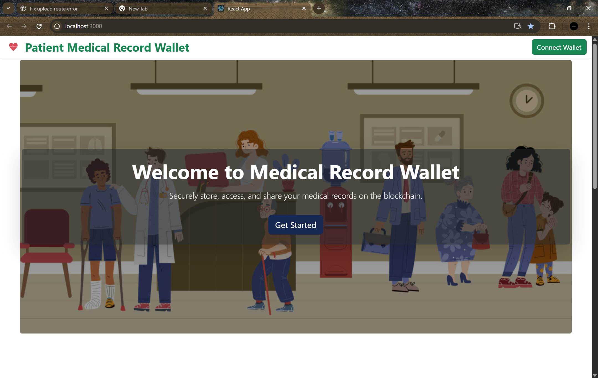
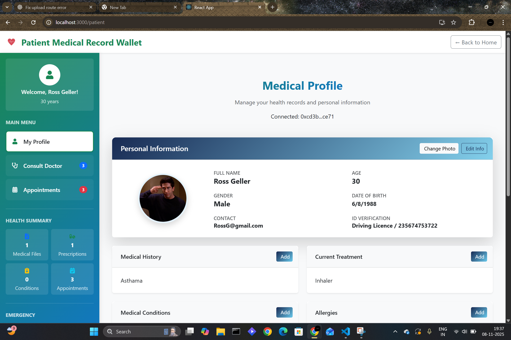
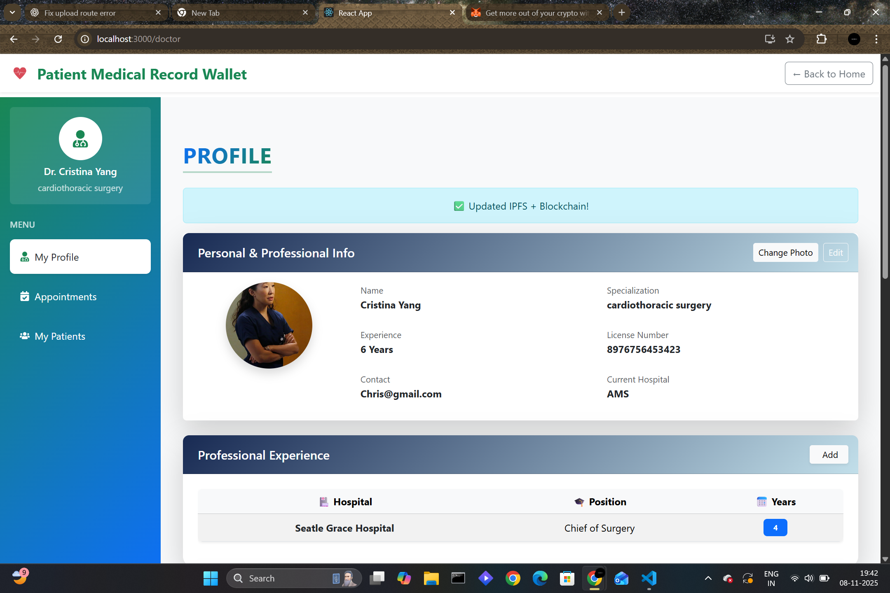
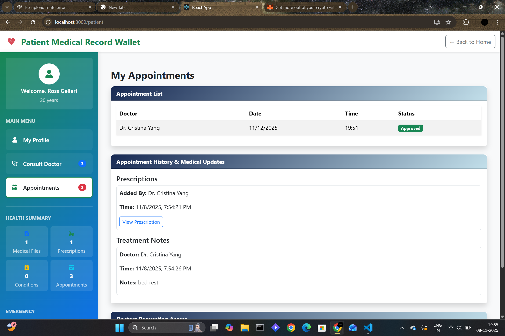

# 🏥 Patient Medical Record Wallet (PMRW)
A decentralized medical record management system built on Ethereum.  
Patients fully own and control access to their medical history while doctors securely update records through blockchain permissions.

---

## ✅ **🎯 Project Objectives**
- Build a decentralized medical record system on **Ethereum blockchain**
- Give **patients full ownership** of their medical history
- Allow **doctors to securely request & access records**
- Enable **appointment scheduling** between patients & doctors
- Ensure **data privacy, transparency, and immutability**
- Use **IPFS** for off-chain secure document storage

---

## ✅ **🛠 Tech Stack**
| Layer | Technology |
|-------|------------|
| Frontend | React.js, Bootstrap |
| Smart Contracts | Solidity (ERC-based custom contracts) |
| Wallet Interaction | MetaMask + Ethers.js |
| Storage | IPFS via Pinata |
| Blockchain | Hardhat Local / Testnet |

---

## ✅ **🚀 Core Features**

### 👤 **Patient Registration**
✅ Connect MetaMask wallet  
✅ Fill personal medical details (name, age, blood group, allergies, etc.)  
✅ Data stored **off-chain (encrypted on IPFS)**  
✅ Wallet address stored **on-chain** as unique patient ID  
✔ Patient now owns a personal **Medical Record Wallet**

---

### 👨‍⚕️ **Doctor Registration & Verification**
- Doctor connects MetaMask
- Submits:
  ✅ Name  
  ✅ Specialization  
  ✅ Medical Registration Number  
- Admin or contract verifies doctor
- Once approved:
  ✅ doctor can add/update patient records  
  ✅ doctor is shown to patients during appointment booking

---

### 📅 **Appointment Booking**
1. Patient selects a verified doctor
2. Chooses **date, time, reason for visit**
3. Smart contract stores appointment as:
   ✅ `Pending`
4. Doctor approves or rejects request on-chain
5. Once approved, appointment becomes **immutable**

---

### 📝 **Medical Record Upload**
After or during consultation, doctor adds:
- Diagnosis summary
- Prescription
- Lab test recommendation
- Follow-up instructions

✅ Record is encrypted → uploaded to **IPFS**  
✅ Smart contract stores:
- IPFS hash
- timestamp
- doctor’s wallet
- record type (prescription, diagnosis, file, etc.)

✅ Only **authorized doctors** can write to patient records  
✅ Guaranteed immutability & accountability

---

### 🔐 **Access Control**
- Patient decides who can view their data
- Grant or revoke doctor access anytime
- Doctors cannot modify records without permission

---

### 👀 **Patient Dashboard**
- Connect with MetaMask
- Fetch medical history directly from blockchain
- View records:
  ✅ Doctor name  
  ✅ Timestamp  
  ✅ Prescription / Files (via IPFS link)

---

## ✅ **🎯 Smart Contract Highlights**
- Stores only **essential identifiers** on-chain
- Medical files stay **off-chain** (IPFS)
- Full cryptographic audit trail
- No central authority controlling data

---
## ✅ 📸 Screenshots

### 🔹 Home Page

### 🔹 Patient Dashboard

### 🔹 Doctor Profile

### 🔹 Medical Record View
 
---

## ✅ **🧪 How to Run Locally**
-cd PatientMedicalRecordWallet
-npm install
-npx hardhat compile
-npx hardhat node
-npx hardhat run scripts/deploy.js --network localhost
-npm start

✅ Open `http://localhost:3000`  
✅ Connect MetaMask → Localhost 8545 network  
✅ Register as patient or doctor

---

## ✅ **📌 Future Enhancements**
✔ AI-based diagnosis suggestions  
✔ Mobile App version  
✔ Add emergency medical access protocol  
✔ Real hospital onboarding & KYC

---

## ✅ **👤 Developer**
**Name:** Vidhi Tyagi 
**GitHub:** (https://github.com/Vidhityagi18)

---

---

